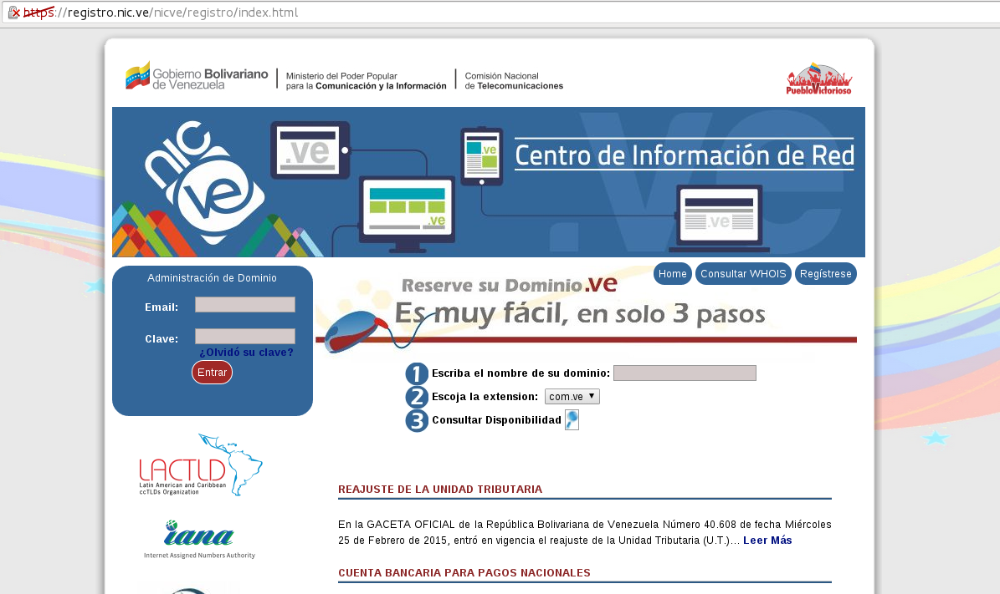
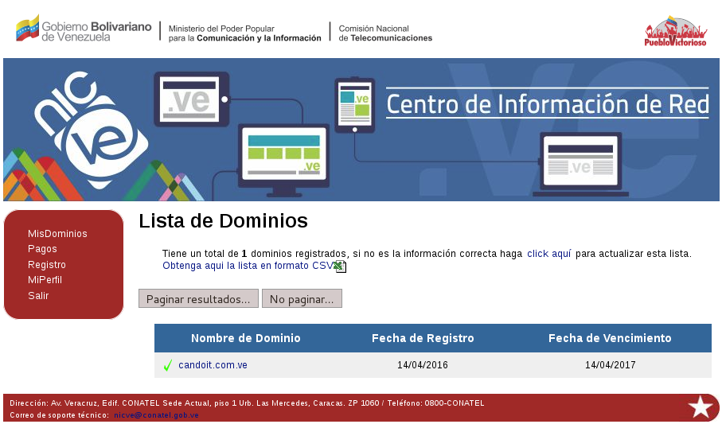
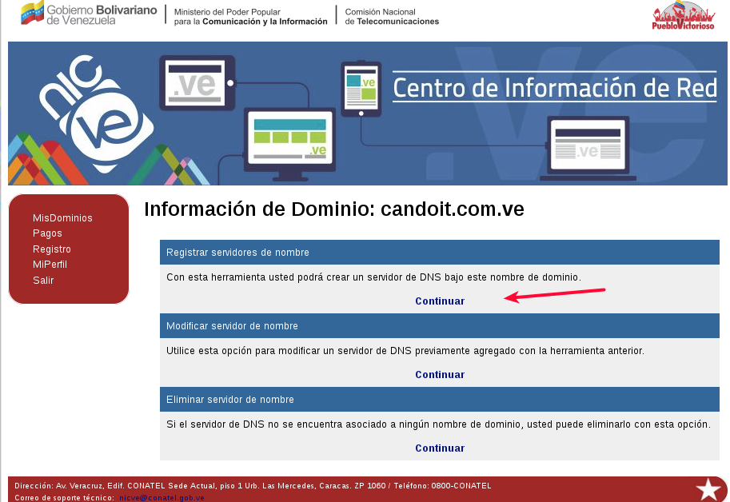
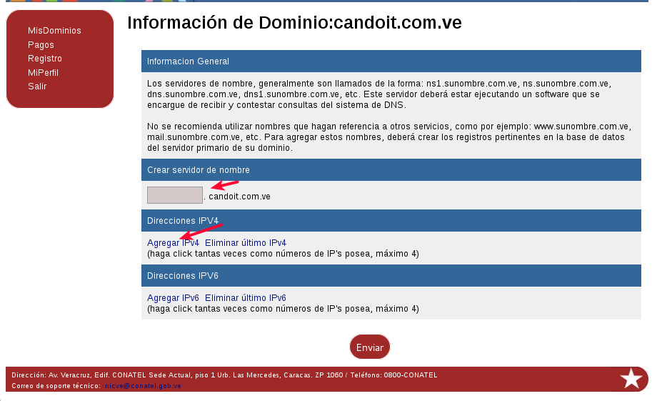
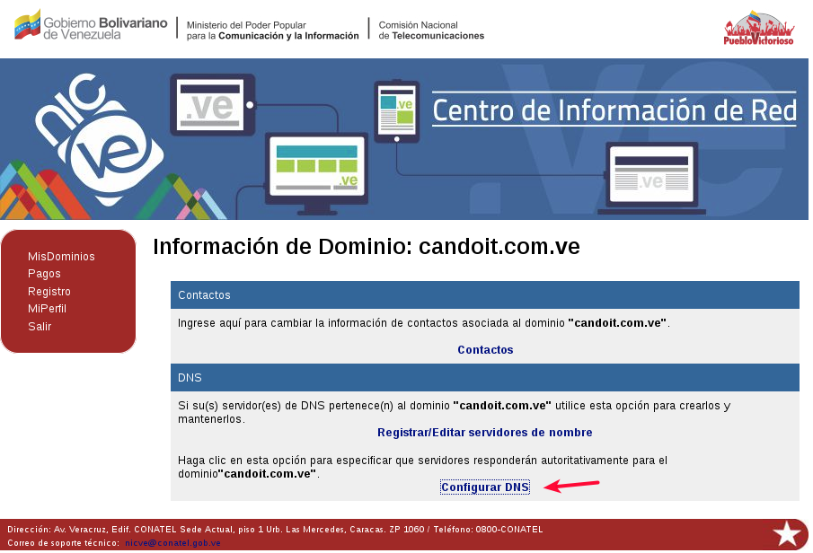
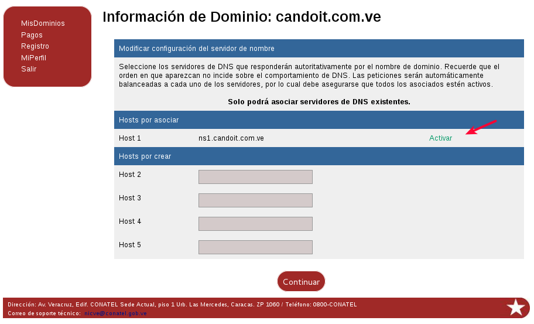
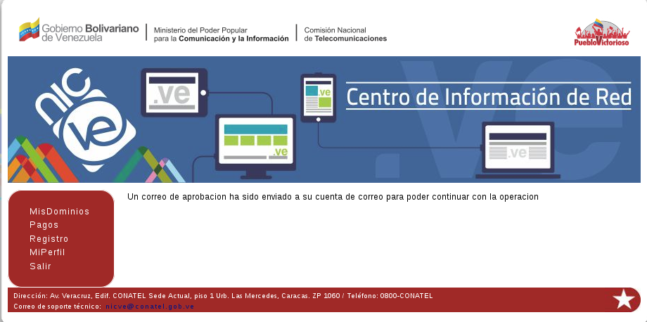

## Comprar y configurar el Dominio en la NIC

Para comprar un dominio lo pueden hacer directamente en la NIC, solo es comprar el dominio no un webhosting, asi es mucho más económico. Hagan el registro e ingresen y compren su dominio.

Cuando hayan comprado el dominio o los dominios podrán visualizarlo en el home de la pagina de la NIC. Hagan click sobre el dominio que quieren asignarle la IP de su router que tiene conexión hacia el internet

Comencemos con la configuración, **Registrar/Editar servidores de nombre**:

Vamos a **Registrar servidores de nombre**

Colocamos el nombre de nuestro servidor y la IP

Luego ya podremos ver la información de nuestro servidor y su dirección IP.

Debemos activarlo.

Nos enviara un correo para confirmar dicha configuración

Luego que nos llegue el correo, confirmamos la configuración.

Listo, esto es más que suficiente.

