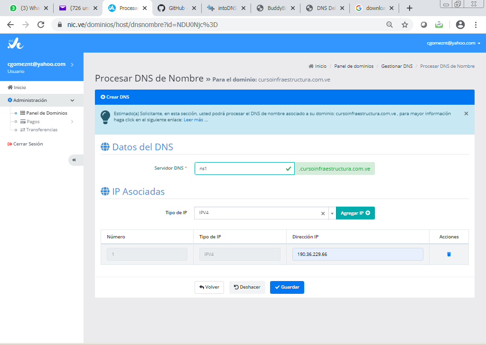

## Comprar y configurar el Dominio en la NIC

Para comprar un dominio lo pueden hacer directamente en la NIC, solo es comprar el dominio no un webhosting, asi es mucho más económico. Hagan el registro e ingresen y compren su dominio.
Utilicemos https://nic.ve/

Asumimos que ya tiene el dominio, es decir, que lo compro con **NIC.ve**, este es el main Dashboard 

En el panel nos vamos a , **Panel de Dominio** ahì vamos a ver nuestros dominios:

En el dominio que queremos editar los DNS, seleccionamos **Acciones** y luego **Administraciòn de DNS**

En la parte superior nos muestra **Registrar Servidor de Nombre (DNS)**. Esta configuraciòn es para indicar como se llamara nuestro DNS y en donde esta.

Le colocamos el nombre (Debe ser igual al que tenemos creado en nuestro DNS) y la IP Publica de nuestro server y pulsamos **Guardar**. Esto es todo, ahora solo resta esperar de 30 min a 1 hora a que la Nic replique entre todos los demas DNS mundiales.

Nos vamos nuevamente al dashboard de **Panel de Dominio** y seleccionamos **Registrar Servidor Autoritativo**
**Importante** Esto solo lo hacemos si tenemos otor Servidor Secundario DNS en la nube, yo en particular utilizo https://www.buddyns.com/, si no crearon un Secundario DNS, omitir este paso.

Aqui colocamos el nombre de nuestro Secundary DNS, como yo utilizo buddyns coloco el nombre que ellos me dan. y pulsamos **Guardar**. Esto es todo, ahora solo resta esperar de 30 min a 1 hora a que la Nic replique entre todos los demas DNS mundiales.

Listo, esto es más que suficiente.

